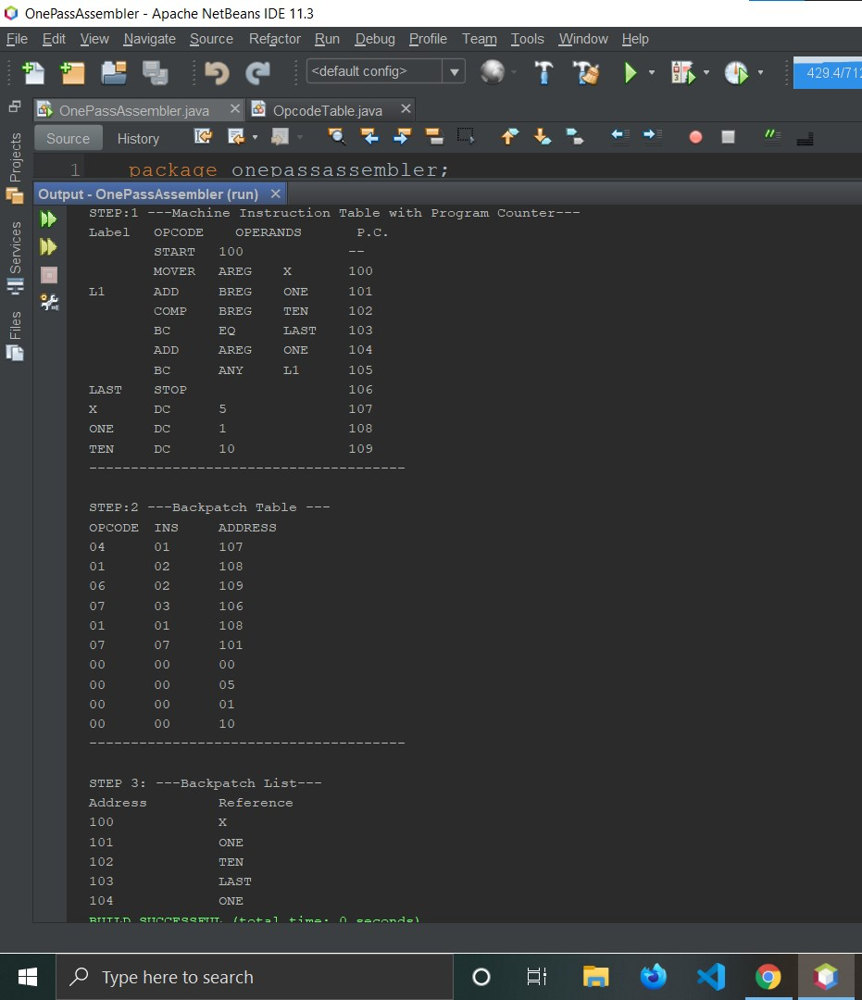

> # One Pass Assembler
_A one pass assembler passes over the source file exactly once, in the same pass collecting the labels, resolving future references and doing the actual assembly._

* One-pass assemblers are used when
    * it is necessary or desirable to avoid a second pass over the source program.
    * The external storage for the intermediate file between two passes is slow or is inconvenient to use.

* _Main problem  : forward references to both data and instructions_

> ## Output

* 
> ## The way ahead
* [Two Pass Assembler](https://github.com/swift1719/TwoPassAssembler)